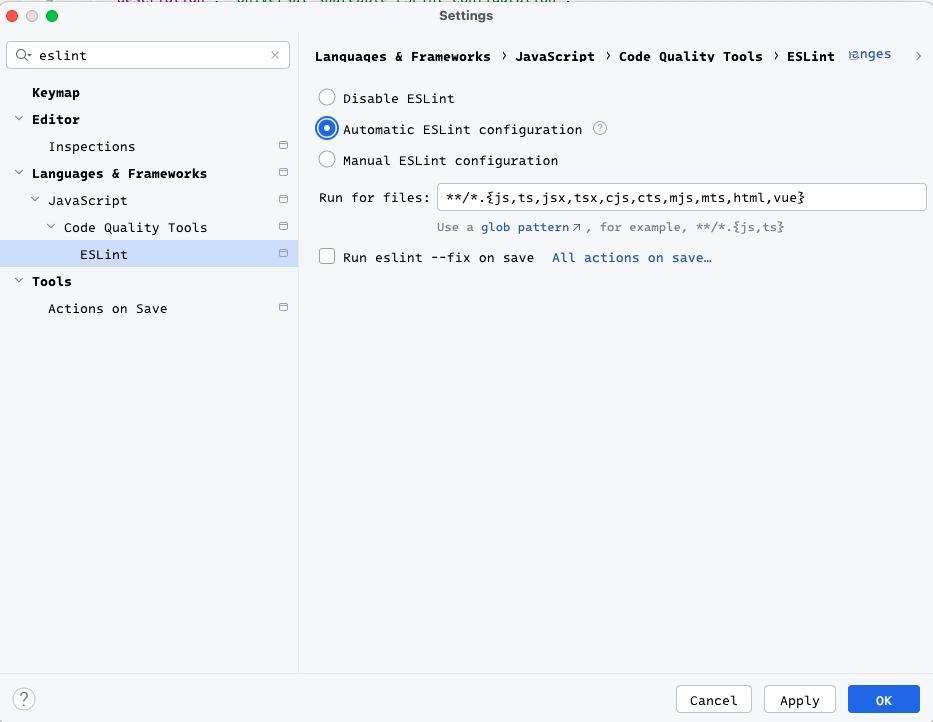

# @bechstein/angular-eslint-config

## Installation

To install the package, follow the steps below:

1. Install peer dependencies:

   ```bash
   npm i -D eslint @eslint/js typescript typescript-eslint angular-eslint
   ```

2. Install `@bechstein/angular-eslint-config`:

   ```bash
   npm i -D @bechstein/angular-eslint-config
   ```

## Usage

- Create a ~~`eslint.config.js`~~/`eslint.config.mjs` file and add the following:

  ```js
  import cbdAngular from "@bechstein/angular-eslint-config";
  import tseslint from "typescript-eslint";

  export default tseslint.config(...cbdAngular, {
    languageOptions: {
      parserOptions: {
        project: ["**/tsconfig*.json"],
        tsconfigRootDir: import.meta.dirname,
      },
    },
  });
  ```

### Helper scripts

The following helper scripts can be added to `package.json`:

```json
{
  "scripts": {
    "eslint:check": "npx eslint .",
    "eslint:fix": "npx eslint . --fix"
  }
}
```

### WebStorm Integration

To enable eslint in your IDE (and also _Run on save_):

_Settings_ --> _Languages & Frameworks_ --> _ESLint_


