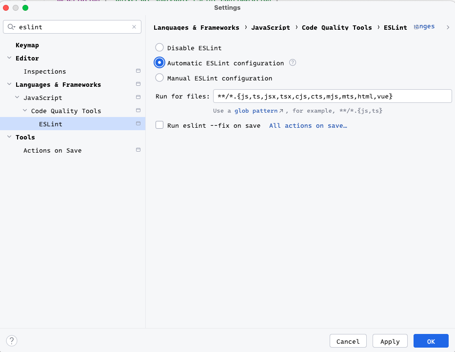

# @bechstein/eslint-config

## Installation

To install the package, follow the steps below:

1. Install peer dependencies:

   ```bash
   npm i -D eslint @eslint/js typescript typescript-eslint
   ```

2. Install `@bechstein/eslint-config`:

   ```bash
   npm i -D @bechstein/eslint-config
   ```

## Usage

- Create a ~~`eslint.config.js`~~/`eslint.config.mjs` file and add the following:

  - **Recommended**

    ```js
    import cbdRecommended from "@bechstein/eslint-config/recommended";
    import tseslint from "typescript-eslint";

    export default tseslint.config(...cbdRecommended, {
      languageOptions: {
        parserOptions: {
          project: ["**/tsconfig*.json"],
          tsconfigRootDir: import.meta.dirname,
        },
      },
    });
    ```

  - **Strict**

    ```js
    import cbdStrict from "@bechstein/eslint-config/strict";
    import tseslint from "typescript-eslint";

    export default tseslint.config(...cbdStrict, {
      languageOptions: {
        parserOptions: {
          project: ["**/tsconfig*.json"],
          tsconfigRootDir: import.meta.dirname,
        },
      },
    });
    ```

### Helper scripts

The following helper scripts can be added to `package.json`:

```json
{
  "scripts": {
    "eslint:check": "npx eslint .",
    "eslint:fix": "npx eslint . --fix"
  }
}
```

### WebStorm Integration

To enable eslint in your IDE (and also _Run on save_):

_Settings_ --> _Languages & Frameworks_ --> _ESLint_


